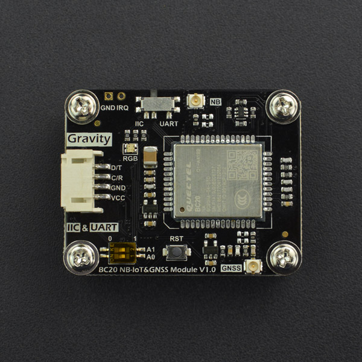

# DFRobot_BC20_Gravity
- [中文版](./README_CN.md)

This Gravity: I2C & UART BC20 NB-IoT & GNSS communication module embraces NB-IoT low-power cellular communication and GPS/BeiDou precise positioning function. As long as the device is located in the area covered by  NB-IoT signal, the data collected by the development board or the device can be easily uploaded into the cloud, no matter indoor or outdoor. This module can also be remotely controlled by sending commands through the cloud, realizing "IOT" through communication and control between the cloud and the real device. It is especially applicable to the environmental monitoring station, bike-sharing, vehicle positioning tracker, and other outdoor IoT application scenarios.

Besides, the equipped GPS/BeiDou positioning function can help obtain precise geographical coordinates and timing information and monitor the device's physical location in real-time by placing the positioning antenna outdoors. Users can visually know the module operating status through the onboard RGB indicator. To work well with general Arduino, micro:bit, control board, Raspberry Pi, and other types of 3.3V/5V development boards, this module employs Gravity I2C & UART standard interface and supports all kinds of development boards that users generally used.



## Product Link（https://www.dfrobot.com/）
  SKU: TEL0130

## Table of Contents

* [Summary](#summary)
* [Installation](#installation)
* [Methods](#methods)
* [Compatibility](#compatibility)
* [History](#history)
* [Credits](#credits)

## Summary

This library provides the acquisition and parsing of satellite data, which contains the interpretation and data parsing of GGA, GLL, GSA, GSV, RMC and VTG in GPS & BeiDou satellite data; it also provides DFRobot's EASY-IOT and ALIYUN's IoT communication routines based on MQTT protocol.

## Installation

Download the library to Raspberry Pi before use, then open the routine folder. Input python Publish_Topic.py into the command line to execute a routine Publish_Topic.py.

## Methods

```python
  '''!
    @brief   Get data from a specified character string
  '''
  def get_rec_data_for_num(self,num):

  '''
    @brief Get data from a specified character string, and not check whether the data is standardized
    @param num
  '''
  def get_rec_data_for_num_no_check(self,num):

  '''!
    @brief  Gets information about a parameter from the returned data.
    @n      For example, the CIMI number of the SIM card
    @param INFO
  '''
  def get_rec_data(self,INFO):

  '''
    @brief Send the command and get the number specified in the returned command
    @param CMD Set command to be parsed
    @param basic The data to be analyzed
    @param n The number of data to be obtained
    @return uint8_t type
  '''
  def get_Int_for_string(self,CMD,basic,n):

  '''
    @brief Change the LED color of the module
    @param newColor
    @n     RED
    @n     BLUE
    @n     GREEN
    @n     YELLOW
    @n     PURPLE
    @n     CYAN
    @n     WHITE  
  '''
  def change_color(self,newcolor):

  '''
    @brief Turn on LED of the module
  '''
  def led_on(self):

  '''
    @brief Turn off LED of the module
  '''
  def led_off(self):

  '''
    @brief Check whether the character string is present in the data obtained from NB module
    @param str The character string to be analyzed
    @return Bool type
    @retval 1 Existed
    @retval 0 Not exist
  '''
  def check_rec_data(self,str):

  '''
    @brief Check whether BC20 exists
    @return Bool type, indicate BC20 existing status
    @retval 1 Existed
    @retval 0 Not exist
  '''
  def check_BC20(self):

  '''
    @brief Enable NB module
    @return Bool type, indicate returning init status
    @retval 1 Succeeded
    @retval 0 Failed
  '''
  def power_on(self):

  '''
    @brief Set BC20 module sleep mode
    @param mode
    @n     eSleepMode_Disable
    @n     eSleepMode_DeepSleep 
    @n     eSleepMode_Light
    @return Bool type
    @retval 1 Succeeded
    @retval 0 Failed
  '''
  def config_sleep_mode(self,mode):

  '''
    @brief Module soft reset
    @return Bool type, indicate whether the reset succeeded
    @retval 1 Succeeded
    @retval 0 Failed
  '''
  def rest(self,mode=1):

  '''
    @brief Check whether NB card exists
    @return Bool type, indicate NB card existing status
    @retval 1 Existed
    @retval 0 Not exist
  '''
  def check_NB_card(self):

  '''
    @brief Remove sth from a char string
    @param sth The character string to be analyzed
    @param str Removed character string
    @return char*type, character string remained
  '''
  def remove_sth_string(self,sth,std):  

  '''
    @brief Remove sth from a char string
    @param sth The character string to be analyzed
    @param std Reserved character string
    @return char*type, reserved character string
  '''
  def get_sth_front_string(self,sth,std):

  '''
    @brief Get IMEI number information
  '''
  def get_GSN(self,cmd):

  '''
    @brief get USIM card identification number
    @return String type, USIM card identification number
  '''
  def get_QCCID(self):

  '''
    @brief Get IMSI code
    @return uint8_t *type, the pointer to identity code array
  '''
  def get_IMI(self):

  '''
    @brief Check whether the device is connected to the nearby NB base station
    @return uint8_t type, get the module connection status
    @retval 1 Connected
    @retval 0 Connecting
  '''
  def get_GATT(self):

  '''
    @brief Get the current network time
    @return String type, the time is output as a character string
  '''
  def get_CLK(self):

  '''
    @brief Get the current NB network signal quality
  '''
  def get_SQ(self):

  '''
    @brief Open MQTT connection channel
    @param connectID
    @param Server
    @param Port
    @return Bool type
    @retval 1 Opening succeeded
    @retval 0 Opening failed
  '''
  def open_MQTT(self,connectID,Server,Port):

  '''
    @brief Close MQTT connection channel
    @param connectID
    @return Bool type
    @retval 1 Closing succeeded
    @retval 0 Closing failed
  '''
  def close_MQTT(self,ConnectID):

  '''
    @brief Set MQTT server information
    @param IPAddress
    @param port
    @param connectID
    @return Bool type
    @retval 1 The setting succeeded
    @retval 0 The setting failed
  '''
  def set_server(self,IPAddress,port,connectID="0"):

  '''
    @brief Publish MQTT message
    @param topic
    @param msg
    @return Bool type
    @retval 1 The publishing succeeded
    @retval 0 The publishing failed
  '''
  def publish(self,topic,msg):  

  '''
    @brief Publish MQTT message
    @param connectID
    @param msgID
    @param qos
    @param retain
    @param topic
    @param msg
    @return Bool type
    @retval 1 The publishing succeeded
    @retval 0 The publishing failed
  '''
  def pub_message(self,connectID,msgID,qos,retain,topic,msg):

  '''
    @brief Whether the device is connected to the server
    @return Bool type
    @retval 1 Connected
    @retval 0 Not connected
  '''
  def connected(self):

  '''
    @brief Connect to server
    @param connectID
    @param clientID
    @param UserName
    @param PassWord
    @return Bool type
    @retval 1 The connecting succeeded
    @retval 0 The connecting failed
  '''
  def connect_server(self,clientID,username,password,connectID="0"):

  '''
    @brief Used to detect the connection between the device and the server
    @return Bool type
    @retval 1 Succeeded
    @retval 0 Failed
  '''
  def get_QMTCONN(self):

  '''
    @brief Subscribe MQTT information
    @param connectID
    @param msgID
    @param topic
    @param qos
    @return Bool type
    @retval 1 The subscription succeeded
    @retval 0 The subscription failed
  '''
  def sub_topic(self,connectID,msgID,topic,qos):

  '''
    @brief Set call back function of MQTT message in subscription mode
  '''
  def set_callback(self,call):

  '''
    @brief Receive data on a loop in subscription mode
  '''
  def loop(self):

  '''
    @brief Set information for Aliyun connection
    @param ProductKey
    @param IPAddress
    @param port
    @param connectID
    @return Bool type
    @retval 1 The setting succeeded
    @retval 0 The setting failed
  '''
  def set_aliyun_server(self,ProductKey,IPAddress,port,connectID="0"):

  '''
    @param ProductKey
    @param DeviceName
    @param DeviceSecret
    @return Bool type
    @retval 1 The connecting succeeded
    @retval 0 The connecting failed 
  ''' 
  def connect_aliyun(self,ProductKey,DeviceName,DeviceSecret): 

  '''
    @brief Set whether to enable GNSS
    @param mode
    @n 	1 Enabled
    @n 	0 Disabled
    @return Bool type
    @retval 1 Enabled
    @retval 0 Disabled
  '''
  def set_QGNSSC(self,mode):

  '''
   @brief Get GNSS status 
   @return uint8_t type
   @retval 1 Enabled
   @retval 0 Disabled
  '''
  def get_QGNSSC(self):

  '''
    @brief Set BC20 to enter PSM mode
    @param mode
    @n     ePSM_OFF
    @n     ePSM_ON
    @n     ePSM_OFF_ResetParam
    @return Bool type
    @retval 1 Succeeded
    @retval 0 Failed
  '''
  def set_PSM_mode(self,status):

  '''
    @brief Configure BC20 module sleep mode
    @param mode
    @n     eSleepMode_Disable
    @n     eSleepMode_DeepSleep 
    @n     eSleepMode_Light
    @return Bool type
    @retval 1 Succeeded
    @retval 0 Failed
  '''
  def config_sleep_mode(self,mode):

  '''
    @brief Set low-power mode
    @param mode
    @n      0 Disable Sleep Mode.
    @n      1 Enable light sleep and deep sleep, wakeup by PSM_EINT (Falling Edge).
    @n      2 Enable light sleep only, wakeup by Main UART.
    @return Bool type
    @retval 1 Succeeded
    @retval 0 Failed
  '''
  def set_QSCLK(self,mode):

  '''
    @brief Control STM32 to enter low-power mode
    @return Bool type
    @retval 1 Succeeded
    @retval 0 Failed
  '''
  def stm_low_power(self):

  '''
    @brief Control STM32 waking up
    @param Awake_Pin Control the pin triggering STM32 waking up
    @return Bool type
    @retval 1 The waking-up succeeded
    @retval 0 The waking-up failed
  '''
  def stm_wake_up(self,Awake_Pin):

  '''
    @brief Wake up BC20 module
    @return Bool type
    @retval 1 The waking-up succeeded
    @retval 0 The waking-up failed
  '''
  def BC20_wake_up(self):

  '''
    @brief Check whether STM32 exists
    @return Bool type, indicate STM32 existing status
    @retval 1 Existed
    @retval 0 Not exist
  '''
  def check_stm_stauts(self):

  '''
    @brief Given a satellite data, which satellite does it start with, how many satellites do you have
    @param start The starting character
    @param num The number of satellites to get data from
    @param str Data character string of the given satellite
    @param sys Data to be written to Flash
    @return uint8_t type
  '''
  def get_satellite_Information(self,start,num,_str,sys):

  '''
    @brief Check which satellite is in use
    @param num Set the data number in the satellite information list
  '''
  def check_satellite_use(self,num):

  '''
    @brief Check which satellite can be used
  '''
  def check_use(self):

  '''
    @brief Get all the satellite information
    @return uint8_t type
    @retval 1 Getting data succeeded
    @retval 0 Getting data failed
  '''
  def get_QGNSSRD(self,cmd):

  '''
    @brief Separate the latitude information from all the satellite information
    @param strdata Raw satellite data
    @return The separated data 
  '''
  def Longitude_conversion(self,strdata):
```  

## Compatibility 

| MCU         | Work Well | Work Wrong | Untested | Remarks |
| ------------ | :--: | :----: | :----: | :--: |
| RaspberryPi2 |      |        |   √    |      |
| RaspberryPi3 |      |        |   √    |      |
| RaspberryPi4 |  √   |        |        |      |

* Python version

| Python  | Work Well | Work Wrong | Untested | Remarks |
| ------- | :--: | :----: | :----: | ---- |
| Python2 |  √   |        |        |      |
| Python3 |  √   |        |        |      |

## History

- 2021/12/17 - Version 1.0.0 released. 

## Credits

Written by Peng Kaixing(kaixing.peng@dfrobot.com), 2020. (Welcome to our website)
