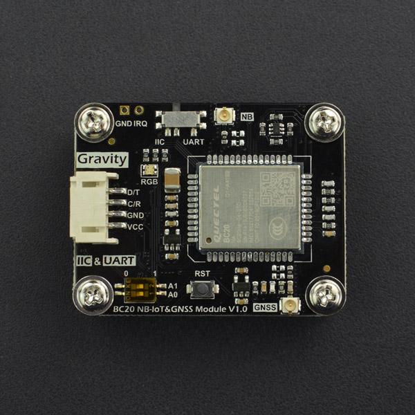

# DFRobot_BC20_Gravity
- [English Version](./README.md)

Gravity：I2C & UART BC20 NB-IoT & GNSS通信模块是具有NB-IoT低功耗蜂窝通信和GPS/BeiDou双星精确定位功能的物联网通信模块。只要设备所在地区在NB-IoT信号覆盖范围内，无论在室内外均可轻松将开发板或设备采集的各类数据上传至云端，当然也可以通过云端发送指令来远程控制设备，实现云端与真实设备的双向通信与控制，实现“物联”，尤其适用于环境监控站、共享单车、车载定位追踪器等户外物联网应用场景。

此外，模块带有GPS/BeiDou双星精确定位功能，只要将定位天线置于室外即可获取精确的地理坐标和授时信息，实时监控设备的物理位置。用户可通过板载RGB指示灯，清晰了解模块的各类工作状态。为了兼容常见的Arduino、micro:bit、掌控和树莓派等各类3.3V/5V开发板，模块还采用了Gravity I2C & UART复合标准接口，并对这些创客用户常用的开发板在软件上作了全面支持。



## 产品链接（https://www.dfrobot.com/）

  SKU: TEL0130

## 目录

* [概述](#概述)
* [库安装](#库安装)
* [方法](#方法)
* [兼容性](#兼容性y)
* [历史](#历史)
* [创作者](#创作者)

## 概述

这个库分别提供了对卫星数据的获取和解析，包含GPS和北斗卫星数据中的GGA、GLL、GSA、GSV、RMC、VTG解释以及数据解析；同时提供了包括DFRobot
的EASY—IOT和ALIYUN的基于MQTT协议的物联网通信例程

## 库安装

要使用这个库，首先将库下载到Raspberry Pi，然后打开例程文件夹。要执行一个例程Publish_Topic.py，请在命令行中输入python Publish_Topic.py

## 方法

```python

  '''!
    @brief   获取指定字符串中哪一个的数据
  '''
  def get_rec_data_for_num(self,num):

  '''
    @brief 获取指定字符串中哪一个的数据,并且不检查数据是否规范
    @param num
  '''
  def get_rec_data_for_num_no_check(self,num):

  '''!
    @brief  Gets information about a parameter from the returned data.
    @n      For example, the CIMI number of the SIM card
    @param INFO
  '''
  def get_rec_data(self,INFO):

  '''
    @brief Send the command and get the number specified in the returned command
    @param CMD 用来设置在哪个命令后的数字
    @param basic 等待分析的数据
    @param n 获取几个数据
    @return uint8_t类型
  '''
  def get_Int_for_string(self,CMD,basic,n):

  '''
    @brief 改变模组的LED灯的颜色
    @param newColor
    @n     RED
    @n     BLUE
    @n     GREEN
    @n     YELLOW
    @n     PURPLE
    @n     CYAN
    @n     WHITE  
  '''
  def change_color(self,newcolor):

  '''
    @brief 打开模组的LED灯
  '''
  def led_on(self):

  '''
    @brief 关闭模组的LED灯
  '''
  def led_off(self):

  '''
    @brief 检查从NB模组中获取的数据中是否有这个字符串
    @param str 等待分析的字符串
    @return bool类型
    @retval 1 唤醒成功
    @retval 0 唤醒失败
  '''
  def check_rec_data(self,str):

  '''
    @brief 检测BC20是否存在
    @return bool类型，表示BC20存在的状态
    @retval 1 存在
    @retval 0 不存在
  '''
  def check_BC20(self):

  '''
    @brief 使能NB模组
    @return bool类型，表示返回初始化的状态
    @retval 1 成功
    @retval 0 失败
  '''
  def power_on(self):

  '''
    @brief 配置BC20模块进入睡眠模式
    @param mode
    @n     eSleepMode_Disable
    @n     eSleepMode_DeepSleep 
    @n     eSleepMode_Light
    @return bool类型
    @retval 1 发布成功
    @retval 0 发布失败
  '''
  def config_sleep_mode(self,mode):

  '''
    @brief 模块软复位
    @return bool类型，复位操作是否成功
    @retval 1 成功
    @retval 0 失败
  '''
  def rest(self,mode=1):

  '''
    @brief 检测NB移动卡是否存在
    @return bool类型，表示STM32存在的状态
    @retval 1 存在
    @retval 0 不存在
  '''
  def check_NB_card(self):

  '''
    @brief 从一串字符中移除某一部分字符串
    @param sth 等待分析的字符串
    @param str 作为保留的字符串
    @return char*类型 剩余的字符串
  '''
  def remove_sth_string(self,sth,std):  

  '''
    @brief 从一串字符中获取某一部分字符串
    @param sth 等待分析的字符串
    @param std 作为保留的字符串
    @return char*类型 保留的字符串
  '''
  def get_sth_front_string(self,sth,std):

  '''
    @brief 获取国际移动设备识别码信息
  '''
  def get_GSN(self,cmd):

  '''
    @brief get USIM card identification number
    @return String类型，USIM card identification number
  '''
  def get_QCCID(self):

  '''
    @brief 获取国际移动用户识别码
    @return uint8_t *类型，识别码数组的指针
  '''
  def get_IMI(self):

  '''
    @brief 检测设备是否已经连接上附近的NB基站
    @return uint8_t类型，获取模块连接状态
    @retval 1 已连接
    @retval 0 正在连接
  '''
  def get_GATT(self):

  '''
    @brief 获取此时的网络时间
    @return String类型，时间以字符串的形式输出
  '''
  def get_CLK(self):

  '''
    @brief 获取此时NB网络信号强度
  '''
  def get_SQ(self):

  '''
    @brief 打开MQTT连接通道
    @param connectID
    @param Server
    @param Port
    @return bool类型
    @retval 1 打开成功
    @retval 0 打开失败
  '''
  def open_MQTT(self,connectID,Server,Port):

  '''
    @brief 关闭MQTT连接通道
    @param connectID
    @return bool类型
    @retval 1 关闭成功
    @retval 0 关闭失败
  '''
  def close_MQTT(self,ConnectID):

  '''
    @brief 设置MQTT服务器信息
    @param IPAddress
    @param port
    @param connectID
    @return bool类型
    @retval 1 设置成功
    @retval 0 设置失败
  '''
  def set_server(self,IPAddress,port,connectID="0"):

  '''
    @brief 发布MQTT信息
    @param topic
    @param msg
    @return bool类型
    @retval 1 发布成功
    @retval 0 发布失败
  '''
  def publish(self,topic,msg):  

  '''
    @brief 发布MQTT信息
    @param connectID
    @param msgID
    @param qos
    @param retain
    @param topic
    @param msg
    @return bool类型
    @retval 1 发布成功
    @retval 0 发布失败
  '''
  def pub_message(self,connectID,msgID,qos,retain,topic,msg):

  '''
    @brief 设备是否已经连接服务器
    @return bool类型
    @retval 1 已经连接
    @retval 0 未连接
  '''
  def connected(self):

  '''
    @brief 连接服务器
    @param connectID
    @param clientID
    @param UserName
    @param PassWord
    @return bool类型
    @retval 1 连接成功
    @retval 0 连接失败
  '''
  def connect_server(self,clientID,username,password,connectID="0"):

  '''
    @brief Used to detect the connection between the device and the server
    @return bool类型
    @retval 1 获取成功
    @retval 0 获取失败
  '''
  def get_QMTCONN(self):

  '''
    @brief 订阅MQTT信息
    @param connectID
    @param msgID
    @param topic
    @param qos
    @return bool类型
    @retval 1 订阅成功
    @retval 0 订阅失败
  '''
  def sub_topic(self,connectID,msgID,topic,qos):

  '''
    @brief 设置订阅模式下MQTT信息的回调函数
  '''
  def set_callback(self,call):

  '''
    @brief 订阅模式下循环接收数据
  '''
  def loop(self):

  '''
    @brief 设置阿里云连接的相关信息
    @param ProductKey
    @param IPAddress
    @param port
    @param connectID
    @return bool类型
    @retval 1 设置成功
    @retval 0 设置失败
  '''
  def set_aliyun_server(self,ProductKey,IPAddress,port,connectID="0"):

  '''
    @param ProductKey
    @param DeviceName
    @param DeviceSecret
    @return bool类型
    @retval 1 连接成功
    @retval 0 连接失败 
  ''' 
  def connect_aliyun(self,ProductKey,DeviceName,DeviceSecret): 

  '''
    @brief 设置GNSS是否打开
    @param mode
    @n 	1 打开
    @n 	0 关闭
    @return bool类型
    @retval 1 已经打开
    @retval 0 没有打开
  '''
  def set_QGNSSC(self,mode):

  '''
   @brief 获取GNSS是否被打开 
   @return uint8_t类型
   @retval 1 已经打开
   @retval 0 没有打开
  '''
  def get_QGNSSC(self):

  '''
    @brief 设置BC20进入PSM模式
    @param mode
    @n     ePSM_OFF
    @n     ePSM_ON
    @n     ePSM_OFF_ResetParam
    @return bool类型
    @retval 1 唤醒成功
    @retval 0 唤醒失败
  '''
  def set_PSM_mode(self,status):

  '''
    @brief 配置BC20模块进入睡眠模式
    @param mode
    @n     eSleepMode_Disable
    @n     eSleepMode_DeepSleep 
    @n     eSleepMode_Light
    @return bool类型
    @retval 1 发布成功
    @retval 0 发布失败
  '''
  def config_sleep_mode(self,mode):

  '''
    @brief 设置低功耗模式
    @param mode
    @n      0 Disable Sleep Mode.
    @n      1 Enable light sleep and deep sleep, wakeup by PSM_EINT (Falling Edge).
    @n      2 Enable light sleep only, wakeup by Main UART.
    @return bool类型
    @retval 1 成功
    @retval 0 失败
  '''
  def set_QSCLK(self,mode):

  '''
    @brief 控制STM32进入低功耗模式
    @return bool类型
    @retval 1 唤醒成功
    @retval 0 唤醒失败
  '''
  def stm_low_power(self):

  '''
    @brief 控制STM32唤醒
    @param Awake_Pin 控制触发唤醒STM32的引脚
    @return bool类型
    @retval 1 唤醒成功
    @retval 0 唤醒失败
  '''
  def stm_wake_up(self,Awake_Pin):

  '''
    @brief 唤醒BC20模块
    @return bool类型
    @retval 1 唤醒成功
    @retval 0 唤醒失败
  '''
  def BC20_wake_up(self):

  '''
    @brief 检测STM32是否存在
    @return bool类型，表示STM32存在的状态
    @retval 1 存在
    @retval 0 不存在
  '''
  def check_stm_stauts(self):

  '''
    @brief Given a satellite data, which satellite does it start with, how many satellites do you have
    @param start 开始的字符
    @param num 获取几颗卫星的数据
    @param str 给定的卫星数据字符串
    @param sys 等待写入flash的数据
    @return uint8_t类型
  '''
  def get_satellite_Information(self,start,num,_str,sys):

  '''
    @brief 检查哪种卫星使用
    @param num 设置卫星信息列表的第几个数据
  '''
  def check_satellite_use(self,num):

  '''
    @brief 检查哪颗卫星可以使用
  '''
  def check_use(self):

  '''
    @brief 获取所有的卫星信息
    @return uint8_t类型
    @retval 1 获取成功
    @retval 0 获取失败
  '''
  def get_QGNSSRD(self,cmd):

  '''
    @brief 从所有的卫星信息中分离出纬度信息
    @param strdata 原始的卫星数据
    @return 分离后的数据
  '''
  def Longitude_conversion(self,strdata):

```  

## 兼容性

| 主板         | 通过 | 未通过 | 未测试 | 备注 |
| ------------ | :--: | :----: | :----: | :--: |
| RaspberryPi2 |      |        |   √    |      |
| RaspberryPi3 |      |        |   √    |      |
| RaspberryPi4 |  √   |        |        |      |

* Python 版本

| Python  | 通过 | 未通过 | 未测试 | 备注 |
| ------- | :--: | :----: | :----: | ---- |
| Python2 |  √   |        |        |      |
| Python3 |  √   |        |        |      |

## 历史

- 2021/12/17 - Version 1.0.0 released. 

## 创作者

Written by Peng Kaixing(kaixing.peng@dfrobot.com), 2020. (Welcome to our website)
